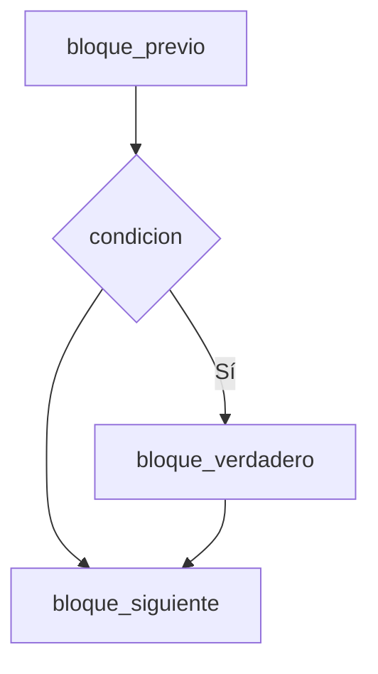
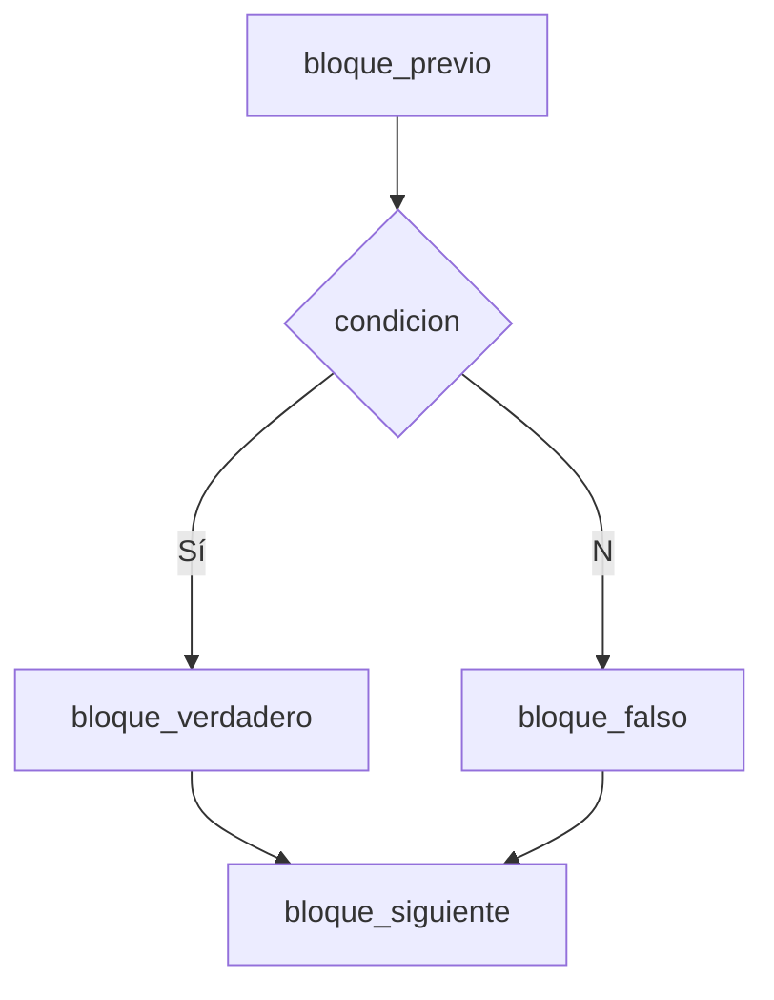
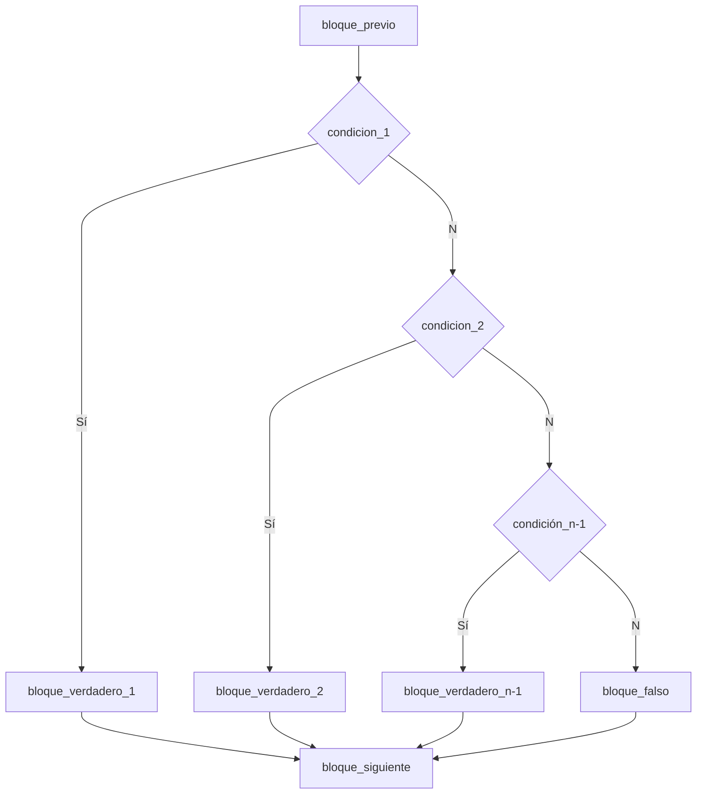

# Programación de Computadores - UNAL
## Condicionales

## Estructura if
La estructura de control condicional o de selección permite ejecutar, o un  grupo de instrucciones u otro grupo si una condición se cumple.

Cuando en el flujo de un programa se desea que se ejecute un grupo de instrucciones cuando un condicional se evalué verdadero, y que se continue con la ejecución del resto del programa se haya o no ejecutado la instrucciones del condicional, se tiene un caso de condicional sin opción alternativa.

Este tipo de estructura se suele utilizar cuando se desea agregar una evaluación intermedia de una expresión cuando la condición se evalúa verdadero, pero que no tiene impacto sobre la ejecución del resto del programa que le sigue al condicional.

**Diagrama de flujo**


**Pseudocódigo**
```pseudocode
bloque_previo
si (condicion) entonces
  bloque_verdadero
bloque_siguiente
```

**python**
```python
<bloque_previo>
if <condicion>:
  <bloque_verdadero>
bloque_siguiente
```

**Ejemplo:** Dado un número n (entero), imprima un mensaje si está entre 2 y 5, al final imprima el número.
```python
n : int = 4
if n >= 2 and n <= 5:
  print("El numero " + str(n)+ " esta entre 2 y 5")
print(n)
```
### Ingreso de datos
Es bastante común ingresar datos a un programa. Para ingresar información por consola se utiliza la función *input()*.

```python
<var> = input("prompt")
```

**Ejemplo:** Ingrese un número n (entero), imprima un mensaje si está entre 2 y 5, al final imprima el número.

```python
n : int 
n = int(input("Ingrese un numero entero: ")) # Conversion a entero
if n >= 2 and n <= 5:
  print("El numero " + str(n)+ " esta entre 2 y 5")
print(n)
```
**Pro tip:** Por defecto *input()* trae un *string*, por lo tanto es necesario hacer la conversión al tipo de dato deseado.

## Estructura if-else
La estructura de control condicional o de selección permite ejecutar, o un  grupo de instrucciones u otro grupo si una condición se cumple o no.

**Diagrama de flujo**


**Pseudocódigo**
```pseudocode
bloque_previo
si (condicion) entonces
  bloque_verdadero
sino 
  bloque_falso
bloque_siguiente
```

**python**
```python
<bloque_previo>
if <condicion>:
  <bloque_verdadero>
else:
  <bloque_falso>
bloque_siguiente
```

**Ejemplo:** Ingrese un número n (entero), imprima un mensaje si está entre 2 y 5, en caso contrario imprima un mensaje que indique si es menor a 2 o mayor a 5, al final imprima el número.

```python
n : int 
n = int(input("Ingrese un numero entero: ")) # Conversion a entero
if n >= 2 and n <= 5:
  print("El numero " + str(n)+ " esta entre 2 y 5")
else:
  if n < 2:
    print("El numero " + str(n)+ " es menor que 2")
  if n > 5:
    print("El numero " + str(n)+ " es mayor que 5")
print(n)
```

**Ejemplo:** Ingrese un dos números (a,b) e imprima cúal es el mayor, si son iguales imprima ambos números.
```python
a : float
b : float
a = float(input("Ingrese el primer numero: ")) 
b = float(input("Ingrese el segundo numero: ")) 
if a == b:
  print(a,b)
else:
  if a > b:
    print(a)
  if b > a:
    print(b)
```
**Ejemplo:** Ingrese un número y determine si es positivo o negativo.
```python
a : float
a = float(input("Ingrese un numero: ")) 
if a >= 0:
  print("El numero "+str(a)+" es positivo")
else:
  print("El numero "+str(a)+" es negativo")
```

**Ejemplo:** Ingrese un número y retorne su valor absoluto.
```python
a : float
a = float(input("Ingrese un numero: ")) 
if a >= 0:
  print("El valor absoluto es "+str(a))
else:
  print("El valor absoluto es "+str(-a))
```

### Condicional ternarario
Es uan forma de abreviar el condicional cuando solo cuenta con una instrucción en el bloque de ejecución.

Retomando el ejemplo del valor absoluto.
```python
a : float
valor_abs : float
a = float(input("Ingrese un numero: ")) 
valor_abs = a if a >= 0 else -a
print("El valor absoluto es "+str(valor_abs))
```

## Estructura if-elif-else
Otra de las opciones para utilizar una estructura condicional es la de enlazar varias estructuras condicionales, de tal manera que solamente se pueda ejecutar un grupo de instrucciones dependiendo de cual de las opciones se evalúa verdadero. De la misma manera que en el caso del condicional tradicional la parte alternativa del final es opcional.

**Diagrama de flujo**


**Pseudocódigo**
```pseudocode
bloque_previo
si (condicion_1) entonces
  bloque_verdadero_1
sino si (condicion_2)
  bloque_verdadero_2
sino si (condicion_n-1)
  bloque_verdadero_n-1
sino
  bloque_falso
bloque_siguiente
```

La codificación en Python de las estructuras condicionales enlazadas es la siguiente, donde la palabra clave elif sirve para establecer la opción
alternativa donde después de ejecutar las instrucciones previas <bloque_previo> se ejecutará <bloque_verdadero_1> si <condicion_1> se evalúa verdadero, en caso de que <condicion_1> se evalúe falso de ejecutará <bloque_verdadero_2> si <condicion_2> se evalúa verdadero, y as´ı se continuará revisando cada una de las condiciones si la anterior se evalúa falso. Si algún <cond_n-1> se evalúa verdadero se ejecuta su respectivo <bloque__verdadero_n-1> y después de ejecutar todas las instrucciones del <bloque_verdadero_n-1> se continua ejecutando las instrucciones siguientes al condicional enlazado <bloque_siguiente>.
Si ninguna <cond_i> se evalúa verdadero y la parte else existe al final de
las estructuras if enlazadas entonces se ejecutarán las instrucciones del
<bloque_falso>.

**python**
```python
<bloque_previo>
if <condicion_1>:
  <bloque_verdadero_1>
elif <condicion_2>:
  <bloque_verdadero_2>
elif <condicion_n-1>:
  <bloque_verdadero_n-1>
else:
  <bloque_falso>
bloque_siguiente
```

**Ejemplo:** Ingrese el peso (kg) y la altura (m) y obtenga el indice de masa corporal.

$$IMC = \frac{masa}{altura^2}$$

<details><summary>IMC Rangos</summary><p>
<div align='center'>
<figure> </br>
<figcaption><b></b></figcaption></figure>
</div>
</p></details><br>

```python
altura : float
altura = float(input("Ingrese la altura en metros: ")) 
peso : float
peso = float(input("Ingrese el peso en kg: "))
imc : float = (masa)/(altura**2) 
if inc < 18.5 :
  print("Bajo peso")
elif imc >= 18.5 and imc < 25:
  print("Normal")
elif imc >= 25 and imc < 30:
  print("Sobrepeso")
elif imc >= 30 and imc < 40:
  print("Obesidad")
else:
  print("Obesidad morbida")
```

## Estructura match (switch)

## Reto 6
Resolver los siguientes problemas usando un notebook de python y subirlos a un repo.

1. Dado un número entero, determinar si ese número corresponde al código ASCII de una vocal minúscula.

2. Dada una cadena de longitud 1, determine si el código ASCII de primera letra de la cadena es par o no.

3. Dado un carácter, construya un programa en Python para determinar si el carácter es un d´ıgito o no.

4. Dado un número real x, construya una función que permita determinar si el número es positivo, negativo o cero. Para cada caso de debe imprimir el texto que se especifica a continuación:
 + Positivo: "El número x es positivo"
 +  Negativo: "El número x es negativo"
 + Cero (0): "El número x es el neutro para la suma"

5. Dado el centro y el radio de un c´ırculo, determinar si un punto de R2 pertenece o no al interior del c´ırculo.

6. Dadas tres longitudes positivas, determinar si con esas longitudes se
puede construir un triángulo.


